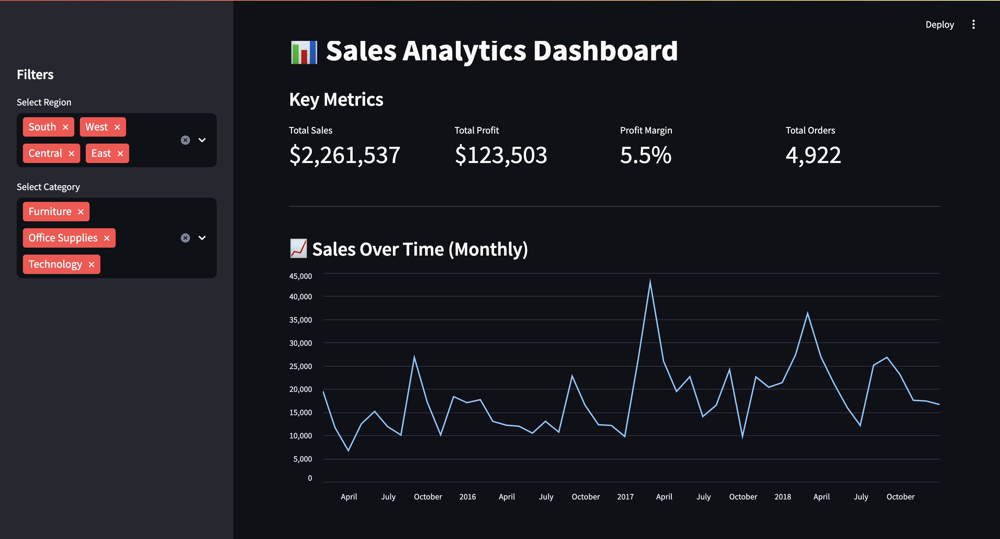
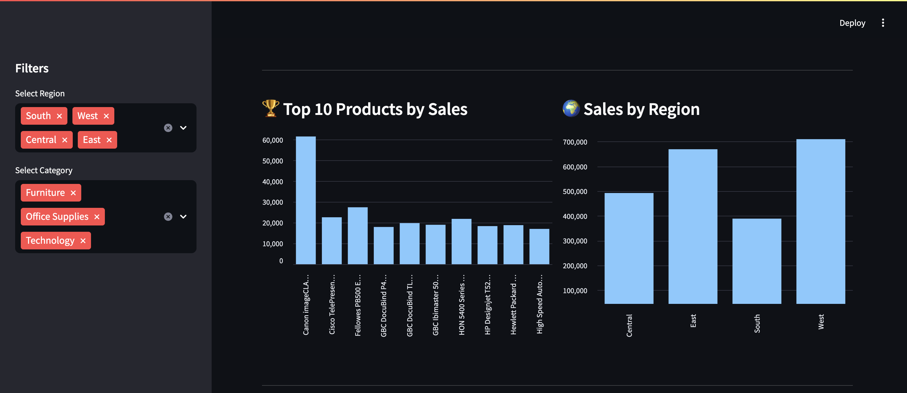
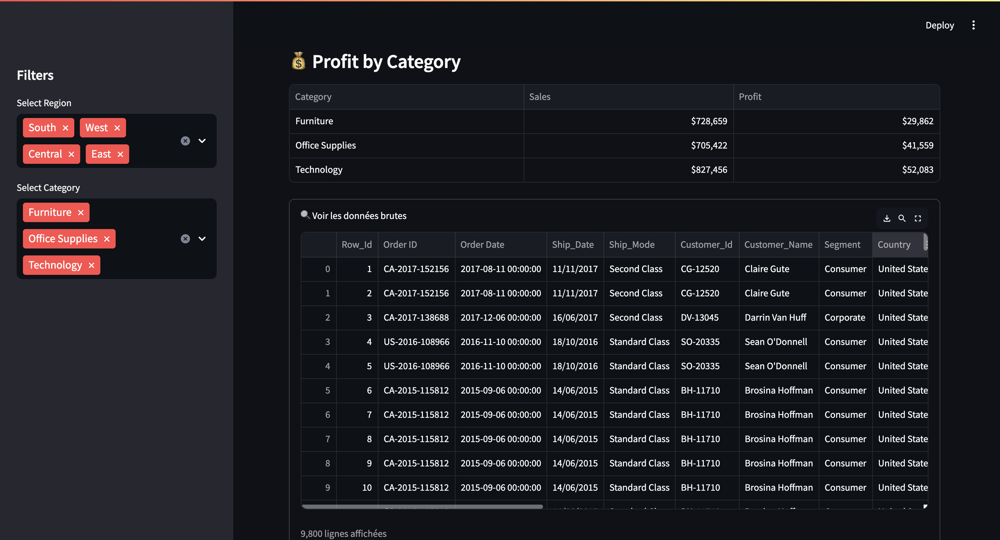

# 📊 Sales Analytics Dashboard

## 🧠 Project Overview

This project is an end-to-end **Sales Analytics Dashboard** designed to analyze business performance and generate actionable insights.

It covers the full data workflow:
- Data cleaning & preparation
- Exploratory Data Analysis (EDA)
- SQL-based analysis
- Interactive dashboard development

---

## 🚀 Tools & Technologies

- **Python**: Pandas, Matplotlib
- **SQL**: PostgreSQL (data storage & querying)
- **Streamlit**: Interactive dashboard
- **Git & GitHub**: Version control

---

## 📂 Project Structure

```
sales-analytics-dashboard/
│
├── data/
│   └── cleaned_superstore.csv
|   └──  superstore.csv
│
├── notebooks/
│   └── analysis.ipynb
|
|──sql/
|   └── create_tables.sql
|   └── import_data.sql
|   └── analysis_queries.sql
│
├── dashboard/
│   └── app.py
│
└── README.md
```

---

## 📊 Features

* 📈 Sales over time analysis
* 🏆 Top 10 products by sales
* 🌍 Sales by region
* 💰 Profit by category
* 🎛️ Interactive filters (region, category)

---

## 📊 Key Business Insights

- Identified high-revenue products and categories
- Detected regional performance differences
- Highlighted profitability variations across segments
- Provided data-driven insights for decision-making

## ▶️ How to Run the Project

1. Clone the repository:

```
git clone https://github.com/azanguim123/sales-analytics-dashboard
cd sales-analytics-dashboard

```

2. Install dependencies

pip install -r requirements.txt

```

3.  Run the dashboard

```
cd dashboard
streamlit run app.py

```

---

Database (PostgreSQL)

The dataset is also stored in a PostgreSQL database (sales_db) for advanced querying.

SQL scripts are available in the /sql folder:

    * create_tables.sql
    * import_data.sql
    * analysis_queries.sql

---

## 🧠 Key Insights

* Identified top-performing products
* Analyzed regional sales trends
* Evaluated profitability across categories

---

## 💼 Skills Demonstrated

* Data Cleaning & Transformation
* Exploratory Data Analysis (EDA)
* SQL Data Analysis (aggregations, window functions)
* Data Visualization
* Dashboard Development
* Business Insight Generation
---

## 📸 Dashboard Preview

assets[]
<p align="center">
  
  
  
</p>
---

## 🎯 Future Improvements

* Add advanced KPIs (customer segmentation, retention)
* Use Plotly for more interactive visualizations
* Deploy dashboard online (Streamlit Cloud / Render)
* Integrate real-time data sources

---

## 👨‍💻 Author

Larry Nelson Azanguim Ndongmo